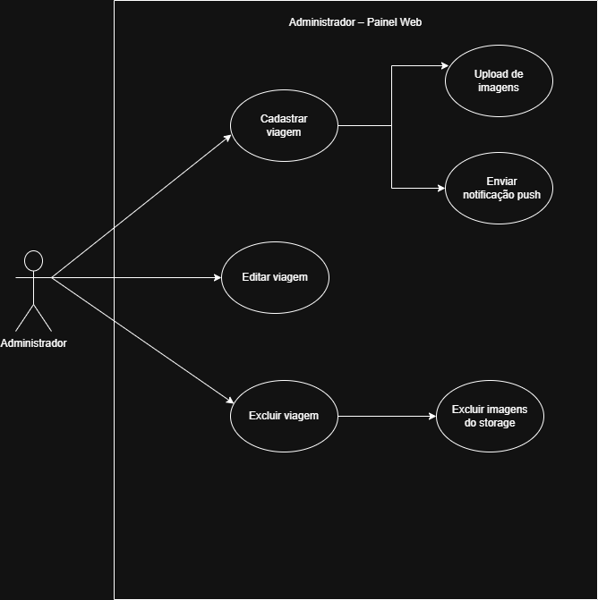

#  Painel Administrativo P3Trip

Este sistema web é o painel administrativo responsável por manipular os dados da aplicação mobile **P3Trip**. 

O **P3Trip** é um aplicativo mobile desenvolvido para facilitar a descoberta e o agendamento de pacotes de viagens, saindo da cidade de Piripiri. A plataforma permite que usuários explorem roteiros turísticos, comparem opções, visualizem detalhes dos destinos e realizem agendamentos.

**Código Fonte do App Mobile:** [https://github.com/larissaNa/P3Trip.git](https://github.com/larissaNa/P3Trip.git)

---

## Funcionalidades

O Painel Administrativo oferece um conjunto de ferramentas para gerenciar o conteúdo do aplicativo P3Trip:

*   **Gestão de Viagens**:
    *   **Cadastrar**: Criação de novos pacotes de viagem com informações detalhadas (título, descrição, destino, preço, datas).
    *   **Editar**: Atualização de informações de viagens existentes.
    *   **Excluir**: Remoção de viagens, incluindo a limpeza automática das imagens associadas no storage.
*   **Gerenciamento de Mídia**:
    *   Upload de múltiplas imagens para cada viagem.
    *   Visualização e remoção de imagens específicas.
*   **Filtros e Busca**:
    *   Filtragem de viagens por destino, faixa de preço e palavra-chave.
*   **Notificações** (Backend/Integração):
    *   Disparo de notificações push para os usuários do app mobile ao cadastrar novas viagens (via integração).

---

##  Arquitetura

O projeto foi desenvolvido seguindo o padrão arquitetural **MVVM (Model-View-ViewModel)**, organizado da seguinte forma:

*   **Model (`src/model`)**: Responsável pela lógica de negócios e acesso a dados. Contém as Entidades, Repositórios (comunicação com Supabase) e Serviços (regras de negócio).
*   **View (`src/view`)**: Camada de apresentação. Contém os componentes React que formam a interface do usuário (UI), construídos com Tailwind CSS e Shadcn/ui.
*   **ViewModel (`src/viewmodel`)**: Intermediário entre a View e o Model. Gerencia o estado da tela e processa as ações do usuário antes de chamar os serviços.

Essa separação garante um código mais limpo, testável e fácil de manter.

---

##  Estratégia de Testes

A estratégia de testes adotada no projeto visa garantir a confiabilidade tanto das regras de negócio quanto da interface do usuário.

### Distribuição e Justificativa

1.  **Testes Unitários (`__tests__/repositories`, `__tests__/services`)**:
    *   **Foco**: Validar a lógica de negócios isolada e as operações de dados.
    *   **Justificativa**: São rápidos de executar e essenciais para garantir que funções individuais (como cálculos, filtros e chamadas de API simuladas) funcionem corretamente antes de serem integradas. Utilizamos `Jest` com mocks para isolar dependências externas como o Supabase.

2.  **Testes de Integração (`__tests__/integration`)**:
    *   **Foco**: Validar a comunicação entre as camadas (View ↔ ViewModel ↔ Service ↔ Repository).
    *   **Justificativa**: Garantem que os componentes funcionam bem em conjunto. Verificamos se uma ação na interface (ex: submeter formulário) dispara corretamente a lógica no ViewModel, que por sua vez chama o Serviço e persiste os dados. Utilizamos `React Testing Library` para simular a interação do usuário.

---

## Diagrama de Caso de Uso



Este diagrama representa um **caso de uso do Painel Web do Administrador**. Nele, o ator **Administrador** pode **cadastrar**, **editar** e **excluir viagens**.

*   Ao **cadastrar uma viagem**, o sistema permite **fazer upload de imagens** e **enviar notificações push**.
*   Quando o administrador **exclui uma viagem**, o sistema também realiza a **exclusão das imagens associadas no storage**, garantindo a limpeza dos dados relacionados.

---

##  Tecnologias Utilizadas

*   **React** (Vite)
*   **TypeScript**
*   **Tailwind CSS**
*   **Shadcn/ui** (Componentes de UI)
*   **Supabase** (Backend as a Service: Database, Storage, Auth)
*   **Jest** & **React Testing Library** (Testes)

## Como Executar

1.  Clone o repositório.
2.  Instale as dependências:
    ```bash
    npm install
    ```
3.  Configure as variáveis de ambiente (`.env`) com suas credenciais do Supabase.
4.  Execute o projeto:
    ```bash
    npm run dev
    ```
5.  Para rodar os testes:
    ```bash
    npm test
    ```
---

##  Autores

*   **Larissa Souza do Nascimento** [2024116TADS0027] - [GitHub](https://github.com/larissaNa)
*   **Maria Isabelly de Brito Rodrigues** [2024116TADS0020] - [GitHub](https://github.com/Isabellybrt)
*   **Luis Guilherme Sampaio Fontenele** [2024116TADS0031] - [GitHub](https://github.com/Luis-Sampaio1)
*   **Júlio Cerqueira Pires** [2024116TADS0004] - [GitHub](https://github.com/julioCerqueira-git)
*   **Vanessa Pereira Cunha** [2024116TADS0023] - [GitHub](https://github.com/vanessapereiracunha)
